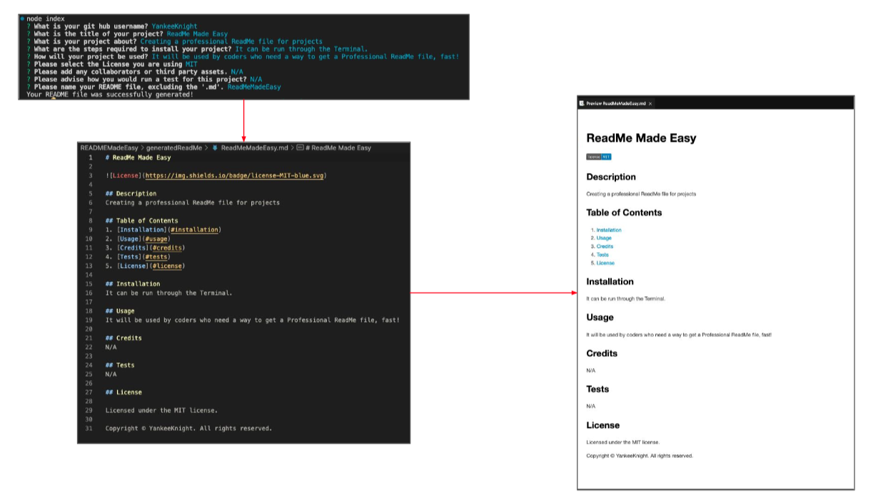

# READMEMadeEasy
Challenge 9 due 1-19-23

## Description
Takes user input through the Terminal using node to generate a professional README file that is exported to a folder called "generatedReadMe".

## Screenshot

## Table of Contents
1. [Installation](#installation)
2. [Usage](#usage)
3. [Credits](#credits)
4. [Tests](#tests)
5. [License](#license)

## Installation
Can be used through running "node index.js" in the Terminal.

## Usage
Provides a quick and easy way to put in the info needed in your README file through Terminal prompts. The information entered generates a file for you to use on any project. 

## Credits
https://shields.io/ - Used for License badges.

## Tests
[Video Walkthrough Link](https://drive.google.com/file/d/1TqdcqAZiYKoB1cH-H8rIOE5n2mF1a7xx/view?usp=share_link)

## License

Licensed under the MIT license.

Copyright © YankeeKnight. All rights reserved.
